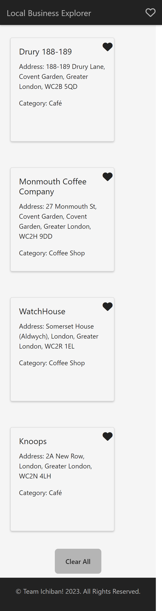

# Local-Business-Explorer

This [Local Business Explorer](<link to deployed webpage here>) webpage allows the user to search for any type of business in any city. A results page then shows 10 businesses related to the users search input in the form of cards with the businesses details as well as the businesses addresses pin pointed on a map. The map and pin points where generated using api calls from [leaflet](https://leafletjs.com/) and [foursquare](https://location.foursquare.com/developer/). The user can then favourite businesses and have the favourited businesses stored in their local storage and displayed as cards on the favourites page. 

## Screenshots 

### Screenshot of results page on desktop 

### Screenshot of favourites page on phone

## Credits 

- search button and clear all button design by [Foundation Button 28](https://getcssscan.com/css-buttons-examples) on css scan.
